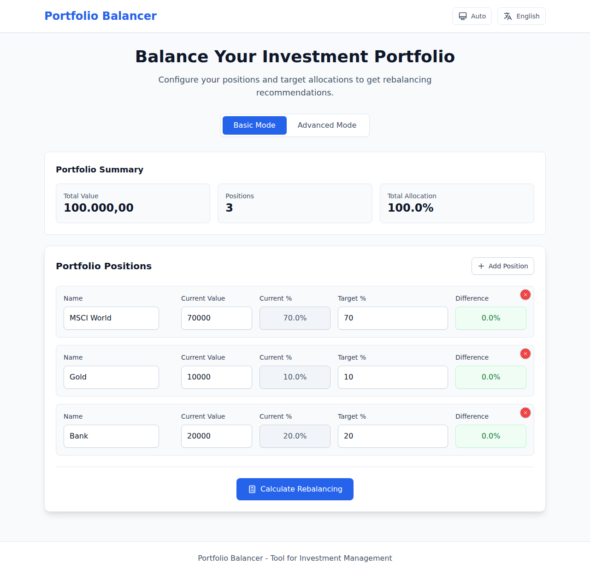
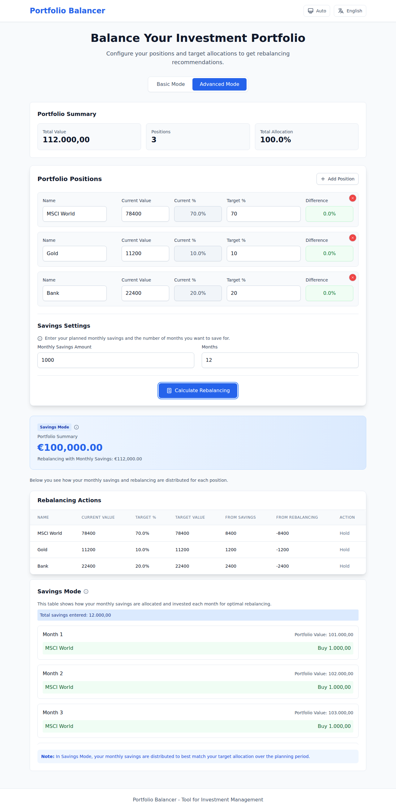
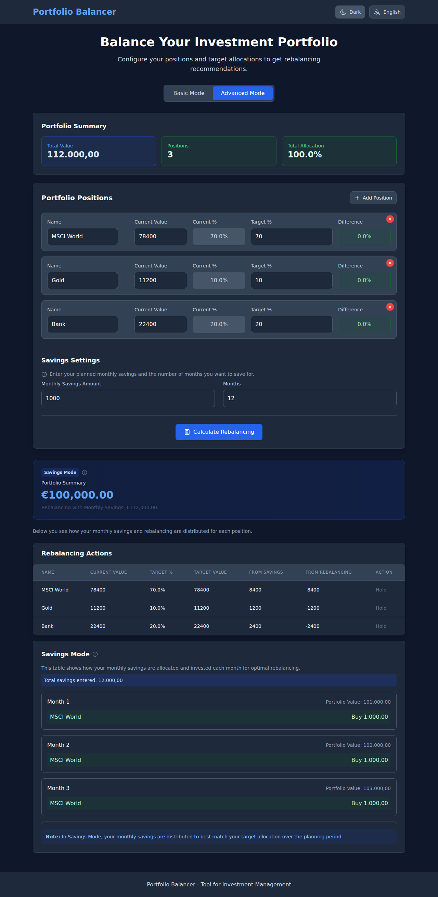

# Portfolio Balancer

A free, open-source web application that helps investors maintain their desired asset allocation through smart rebalancing calculations. Whether you're a DIY investor or financial advisor, Portfolio Balancer makes it easy to keep your portfolio on track.

🌐 **[Try it now](https://maperz.github.io/portfolio-balancer/)** - No signup required!

> **Note:** This project was entirely bootstrapped and developed with AI tooling to test their capabilities and understand modern AI workflow.

## What is Portfolio Balancer?

Portfolio Balancer is a powerful yet simple tool that answers the question: *"How should I rebalance my investment portfolio?"*

Instead of manually calculating which assets to buy or sell to maintain your target allocation, Portfolio Balancer does it for you instantly. Just enter your current positions and target percentages, and get clear, actionable recommendations.

### Key Benefits

- 💰 **Free & Private** - Runs entirely in your browser, no data leaves your device
- 🎯 **Accurate** - Calculates exact buy/sell amounts to match your target allocation
- 📊 **Smart Savings** - Advanced mode optimizes how monthly contributions should be allocated
- 🌍 **Multilingual** - Available in English and German
- 🌓 **Dark Mode** - Easy on the eyes, day or night
- 📱 **Mobile-Friendly** - Works on any device

## Screenshots

### Basic Mode
Simple portfolio rebalancing with instant recommendations:



### Advanced Mode with Monthly Savings
Plan your savings strategy over time with month-by-month allocation:



### Dark Mode Support
Comfortable viewing in any lighting condition:



## How It Works

### Basic Mode

1. **Add Your Positions** - Enter each investment (stocks, bonds, ETFs, etc.) with its current value
2. **Set Target Allocation** - Define what percentage each position should represent
3. **Get Recommendations** - See exactly how much to buy or sell for each position

**Example:**
- You have €70,000 in stocks, €10,000 in gold, and €20,000 in cash
- Your target is 70% stocks, 10% gold, 20% cash
- Portfolio is already balanced → Hold everything ✅

### Advanced Mode

Everything from Basic Mode, plus:

1. **Add Monthly Savings** - Enter how much you plan to invest each month
2. **Set Time Horizon** - Choose your planning period (e.g., 12 months)
3. **Get Monthly Strategy** - See exactly where to invest each month's savings

The app optimizes your monthly contributions to gradually rebalance your portfolio over time, minimizing the need to sell existing positions.

## Quick Start

### Using the Live App

Just visit **[maperz.github.io/portfolio-balancer](https://maperz.github.io/portfolio-balancer/)** - no installation needed!

### Running Locally

```bash
# Clone the repository
git clone https://github.com/maperz/portfolio-balancer.git
cd portfolio-balancer

# Install dependencies
npm install

# Start development server
npm run dev
```

Then open `http://localhost:3000` in your browser.

## Features

### Core Capabilities

- ✅ **Portfolio Analysis** - See current allocation vs. target at a glance
- ✅ **Smart Rebalancing** - Get specific buy/sell recommendations
- ✅ **Savings Optimizer** - Plan how to invest monthly contributions
- ✅ **Multi-Currency** - Automatic formatting based on language preference
- ✅ **Export Ready** - Copy results for your records

### User Experience

- 🎨 **Clean Interface** - Intuitive design built with Tailwind CSS
- 🌓 **Theme Support** - Light, Dark, and Auto modes
- 🌍 **Internationalization** - English and German (easily extensible)
- 📱 **Responsive Design** - Works seamlessly on desktop, tablet, and mobile
- ⚡ **Instant Calculations** - No loading times, everything happens in your browser

## Use Cases

### For Individual Investors

- **Portfolio Maintenance** - Regular rebalancing to stay on target
- **Savings Planning** - Optimize where to invest monthly contributions
- **What-If Analysis** - See the impact of different allocation strategies
- **Tax Planning** - Identify positions that need selling (consider tax implications separately)

### For Financial Advisors

- **Client Education** - Visual tool to explain rebalancing concepts
- **Quick Calculations** - Fast scenario analysis during client meetings
- **Transparent Recommendations** - Show clients exactly why you recommend certain trades

## Deployment

### Deploy Your Own Instance

#### Option 1: GitHub Pages (Automatic)
1. Fork this repository
2. Go to Settings → Pages
3. Select "GitHub Actions" as the source
4. Push to main branch - the site will automatically build and deploy
5. Your site will be available at `https://yourusername.github.io/portfolio-balancer`

#### Option 2: Any Static Host
```bash
# Build for production
npm run build

# Deploy the `dist` folder to:
# - Netlify, Vercel, Cloudflare Pages
# - AWS S3, Azure Static Web Apps
# - Or any other static hosting service
```

## For Developers

### Tech Stack

- **Frontend Framework:** React 18 with Hooks and Context API
- **Styling:** Tailwind CSS with custom design system
- **Build Tool:** Vite for fast development and optimized builds
- **Internationalization:** Custom i18n system with JSON translation files
- **State Management:** React Context (no external state library needed)

### Project Structure

```
portfolio-balancer/
├── src/
│   ├── components/         # React components
│   │   ├── Header.jsx
│   │   ├── Hero.jsx
│   │   ├── ModeToggle.jsx
│   │   ├── PortfolioForm.jsx
│   │   ├── PositionRow.jsx
│   │   ├── AdvancedSettings.jsx
│   │   ├── Results.jsx
│   │   └── Footer.jsx
│   ├── contexts/          # React contexts
│   │   ├── LanguageContext.jsx
│   │   ├── PortfolioContext.jsx
│   │   └── ThemeContext.jsx
│   ├── locales/           # Translation files
│   │   ├── en.json
│   │   └── de.json
│   ├── App.jsx            # Main App component
│   ├── main.jsx           # React entry point
│   └── index.css          # Tailwind CSS styles
├── .github/
│   ├── workflows/         # CI/CD pipelines
│   └── images/            # Screenshots for README
├── package.json
├── vite.config.js
├── tailwind.config.js
└── README.md
```

### How the Algorithm Works

The rebalancing calculation follows these steps:

1. **Calculate Total Portfolio Value**
   ```javascript
   totalValue = sum(currentValues) + (monthlySavings × months)
   ```

2. **Determine Target Values**
   ```javascript
   targetValue = (targetPercentage / 100) × totalValue
   ```

3. **Calculate Differences**
   ```javascript
   difference = targetValue - currentValue
   ```

4. **Generate Actions**
   - Positive difference → Buy recommendation
   - Negative difference → Sell recommendation
   - Near zero (< 0.01%) → Hold recommendation

### Development Commands

```bash
# Start development server with hot reload
npm run dev

# Build for production
npm run build

# Preview production build locally
npm run preview

# Lint code
npm run lint

# Fix linting issues automatically
npm run lint:fix
```

### Adding New Languages

1. Create a translation file in `src/locales/`:
```json
// src/locales/fr.json
{
  "title": "Équilibreur de Portefeuille",
  "subtitle": "Équilibrez votre portefeuille d'investissement",
  // ... other translations
}
```

2. Import and register in `LanguageContext.jsx`:
```javascript
import frTranslations from '../locales/fr.json';

const translations = {
  en: enTranslations,
  de: deTranslations,
  fr: frTranslations,
};
```

3. Add language selector option in `Header.jsx`

### Customizing the Theme

Modify `tailwind.config.js` to customize colors and styling:
```javascript
module.exports = {
  theme: {
    extend: {
      colors: {
        // Your custom color palette
      },
    },
  },
}
```

### Browser Compatibility

- Chrome 88+
- Firefox 88+
- Safari 14+
- Edge 88+

Modern browsers with ES2020 support and CSS Grid/Flexbox are required.

## Contributing

We welcome contributions! This is an open-source project built by the community.

### How to Contribute

1. **Fork the repository**
2. **Create a feature branch** (`git checkout -b feature/amazing-feature`)
3. **Make your changes** and test thoroughly
4. **Commit your changes** (`git commit -m 'Add amazing feature'`)
5. **Push to the branch** (`git push origin feature/amazing-feature`)
6. **Open a Pull Request**

### Areas Where We'd Love Help

- 🌍 **Translations** - Add support for more languages
- 🎨 **UI/UX Improvements** - Better designs, accessibility enhancements
- 📊 **Features** - New rebalancing strategies, export formats
- 🧪 **Testing** - Add test coverage
- 📝 **Documentation** - Improve guides and examples
- 🐛 **Bug Fixes** - Help squash bugs

### Development Guidelines

- Follow existing code style (use `npm run lint`)
- Test across different browsers
- Keep changes focused and atomic
- Update documentation as needed

## Frequently Asked Questions

**Q: Is my data safe?**  
A: Yes! All calculations happen in your browser. No data is sent to any server.

**Q: Can I use this for tax-loss harvesting?**  
A: The tool shows which positions to sell, but you'll need to consider tax implications separately.

**Q: Does it support multiple currencies?**  
A: Yes! Currency formatting adjusts based on your language selection.

**Q: Can I save my portfolio?**  
A: Currently, data is stored in your browser's local storage. Refresh-safe, but not synced across devices.

## Roadmap

Potential future enhancements:

- [ ] Import/export portfolio data (CSV, JSON)
- [ ] Save multiple portfolio scenarios
- [ ] Tax-loss harvesting optimization
- [ ] More rebalancing strategies (calendar, threshold-based)
- [ ] Integration with brokerage APIs
- [ ] Mobile app versions

## Disclaimer

⚠️ **Important:** This tool is for educational and planning purposes only. It does not constitute financial advice. 

- Always consult with a qualified financial advisor before making investment decisions
- Consider tax implications before selling assets
- Past performance doesn't guarantee future results
- The tool assumes assets maintain their current value (doesn't predict market movements)

## License

This project is open source and available under the MIT License. Feel free to use, modify, and distribute as needed.

## Support & Feedback

- 🐛 **Bug Reports:** [Open an issue](https://github.com/maperz/portfolio-balancer/issues)
- 💡 **Feature Requests:** [Submit an idea](https://github.com/maperz/portfolio-balancer/issues)
- 💬 **Questions:** Check existing issues or start a discussion
- ⭐ **Like the project?** Give it a star on GitHub!

## Acknowledgments

Built with modern web technologies and powered by AI-assisted development tools.

---

**Made with ❤️ for the investing community**

Try it now: **[maperz.github.io/portfolio-balancer](https://maperz.github.io/portfolio-balancer/)**
